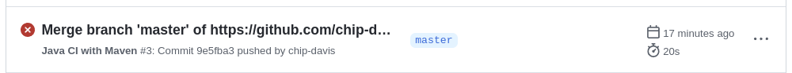
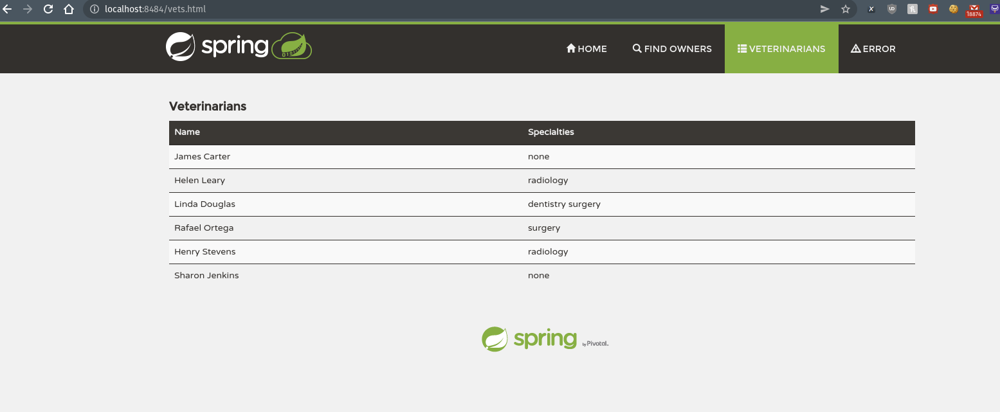

**Your GitHub Actions dashboard showing a successful first build:**

---

**Your GitHub repository with the readme.md file selected showing the code that you changed to update the badge:**

---

**Your GitHub repository with the readme.md file selected showing the build success
status after you’ve updated the badge markdown:**

---

**The section of the POM file showing the coordinates after you’ve commented them
out:**

---

**Your GitHub Actions dashboard showing the unsuccessful build after the breaking
change:**

---

**Your GitHub repository with the readme.md file selected showing the build failed
status after the GitHub workflow fails:**
Note: I am not sure why the badge still says passing. At the top of the screen, you can see that the build failed. But this is the status of the  readme.

---

**The section of the POM file showing the coordinates after you’ve fixed them:**

---

**Your GitHub Actions dashboard showing the successful build after the breaking
change has been fixed:**

---

**Your GitHub repository with the readme.md file selected showing the build success
status after the GitHub workflow has recovered:**

---

**Homework 8**

---

**DOCKER**

**Your dockerfile. Please provide a link to this file rather than a screen capture.**

[link to Dockerfile.](https://github.com/chip-davis/spring-petclinic/blob/master/Dockerfile)

---

**Your running docker instance as shown by a ps command.**

---

**Your browser accessing the main page of the website from your local container.**

---

**DOCKER COMPOSE - MYSQL ONLY**

**The output from the docker-compose up command**

[link to output](https://github.com/chip-davis/spring-petclinic/blob/master/docker-compose-mysql-only-output.md)

---

**Your browser accessing the “Veterinarians” page of the website from your local container when you run the application from the host system.**

---

**A section of the stack trace generated when you attempt to run the application
container that has been updated to use MySQL**

I hope this is what you are asking for.

---

**DOCKER COMPOSE - APP SERVER AND MYSQL**

**Your updated docker-compose.yml file containing the application server, built from
your local Dockerfile, and the existing MySQL configuration. Please provide a link
to this file rather than a screen capture.**

[docker-compose.yml](https://github.com/chip-davis/spring-petclinic/blob/master/docker-compose.yml)

---

**Your updated application-mysql.properties file containing the URL change for
the database server. Please provide a link to this file rather than a screen capture.**

[application-mysql.properties](https://github.com/chip-davis/spring-petclinic/blob/master/src/main/resources/application-mysql.properties)

---

**The output from the docker-compose up command.**

[docker-compose up output](https://github.com/chip-davis/spring-petclinic/blob/master/docker-compose-up-output-mysql-application.md)

---

**Your browser accessing the “Veterinarians” page of the website from your local container.**

